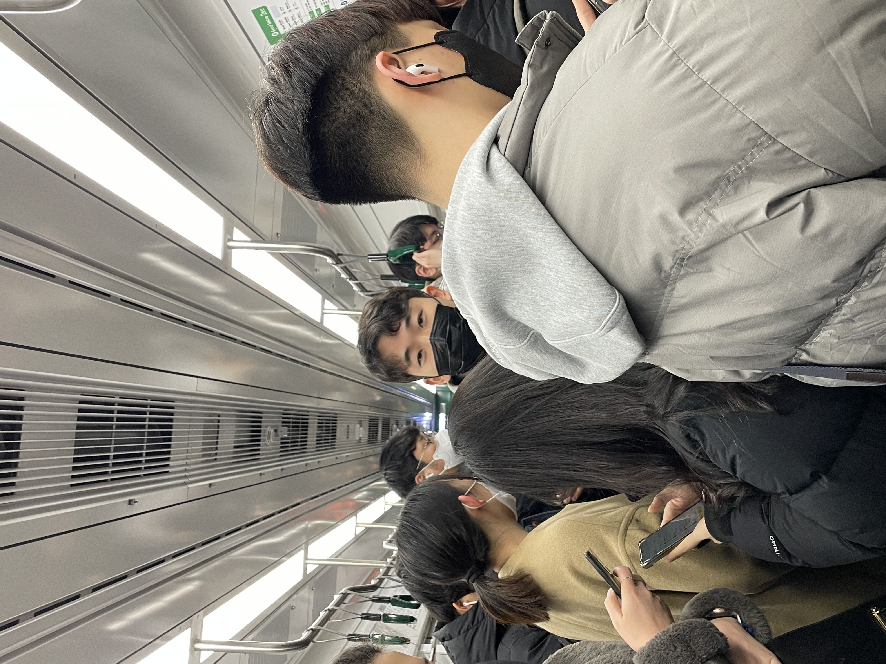

# onLeeGE

<!DOCTYPE html>
  <html lang="ko">
    <head>
      <meta charset="UTF-8 />
      <title>Automatical Slide In Vertically</title>
      <link rel="stylesheet" href="css/style.css" />
    </head>
    <body>
      

        

          <ul>
                          System.out.println("의 생일을 축하합니다♡");
            <li></li>  
            <li></li>  
            <li></li>  
            <li></li>
            <li></li>
          </ul>
        

      

    </body>
  </html>
