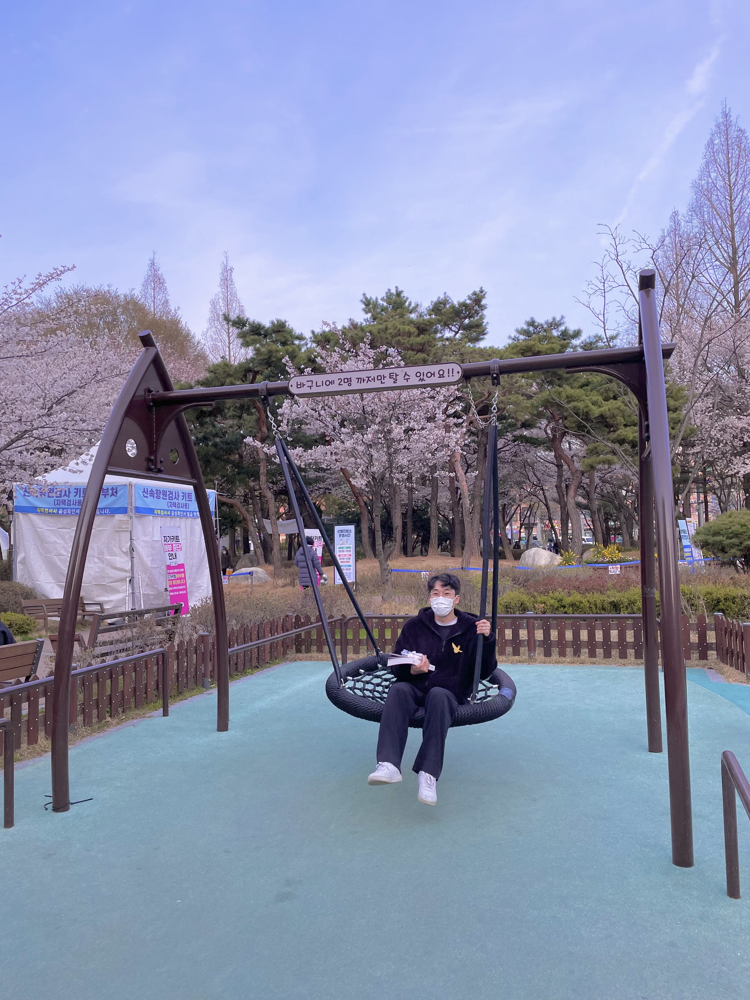
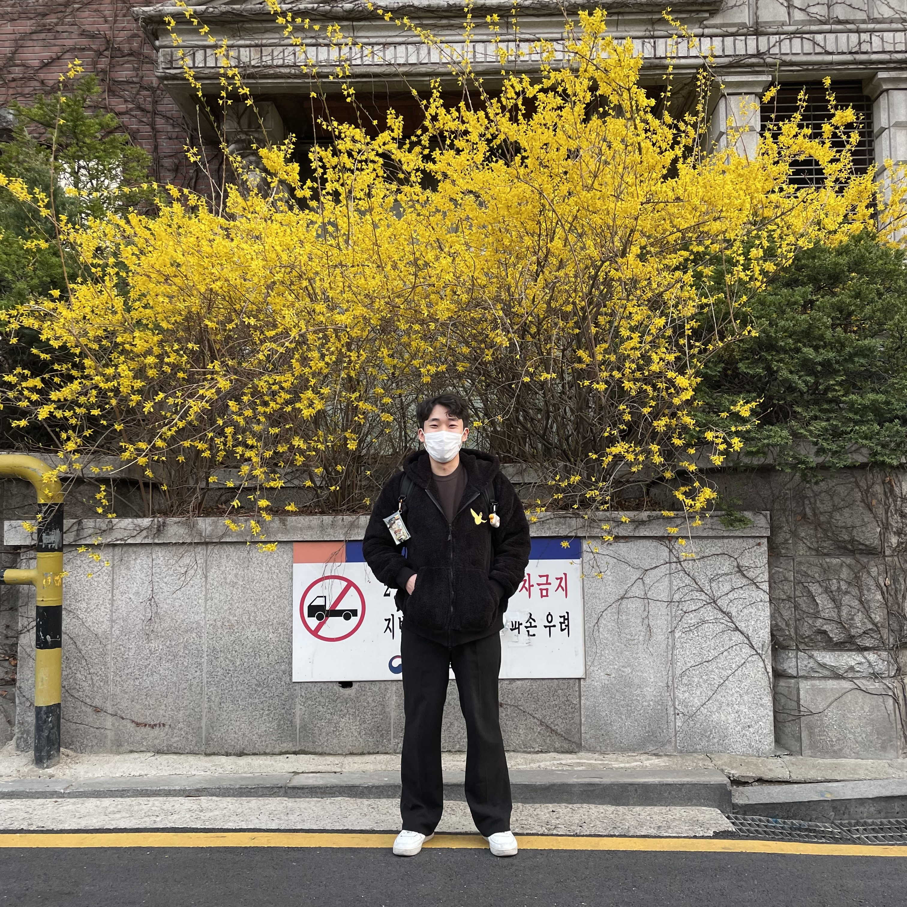

# ♥HAPPY BIRTH DAY♥

  <html lang="ko">
    <head>
      <title>♥HAPPY BIRTH DAY♥</title>
      <link rel="stylesheet" href="css/style.css" />
      
      
    </head>
  
  
  
    <body>
      

        

          <ul>
             

             
　　　　　　　　민재에게 강은'이'가 어떤 존재냐면        

             
어둠이 기승을 부려도 이겨낼 '강'인한 힘과 용기를 불어주고,

             
　　　별처럼 밝게 비춰 주는 '은'하수 같은 존재야.

               
<bold>        덕분에 늘 행복해, 고마워 사랑해 </bold>
               
             
미소가 아름다운 남자 이강은의 생일을 축하합니다ㅋㅋ

                          

            <li></li>  
            <li></li>  
            <li></li>  
            <li></li>
            <li></li>
          </ul>
        

      

    </body>
  </html>
